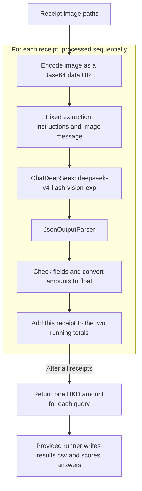

# FTEC5660 Homework 1: Receipt Chain

Build a LangChain pipeline that reads every supermarket receipt in a folder
with the vision-capable DeepSeek Flash model and answers these two questions:

1. How much money did I spend in total for these bills?
2. How much would I have had to pay without the discount?

For this homework, **amount spent** means the final payment after the receipt's
rounding line. **Without the discount** means the sum of the original positive
item prices: add back every promotion, coupon, member, app, packaging-damage,
and percentage discount, but do not add back rounding.

## Student task

Only edit the two functions in `hw1.py` that contain `### YOUR CODE HERE`:

- `build_chain()` creates your LangChain chain.
- `answer_queries()` runs the chain on the receipt images and returns one final
  response for each question.

You may use prompt chaining, routing, parallel calls, reflection, or a
combination. Your final responses should each contain one HKD amount. Do not
hard-code filenames or public answers; grading uses unseen receipt folders.

## Setup and public test

```bash
python3 -m venv .venv
source .venv/bin/activate
pip install -r requirements.txt
```

Put your DeepSeek key after `DEEPSEEK_API_KEY=` in `.env`, then run:

```bash
python3 hw1.py --image-folder public_test
```

The program creates `results.csv` in the current directory. Its columns are
`query`, `model_response`, and `correctness`. The public answers are in
`public_test/ground_truth.json`, which the provided runner uses for scoring
when the file is available.

The required model is `deepseek-v4-flash-vision-exp`, the vision-capable
DeepSeek Flash model. JPEG, PNG, GIF, and WebP inputs are accepted by the
homework runner.


## Homework 1 solution

### Chain design



### Solution description

I separate receipt reading from arithmetic. `build_chain()` creates a LangChain
pipeline of a prompt template, `deepseek-v4-flash-vision-exp`, and a JSON output
parser once. `answer_queries()` then sends each receipt as a Base64 image in a
human message. The model extracts the final payment after rounding, the subtotal
before rounding, and a list of individual discount amounts. The prompt distinguishes
the final payment from cash tendered and change, excludes rounding from discounts,
and asks the model not to count savings summaries twice. Python checks the required
fields, converts the amounts to `float`, rejects negative amounts, and adds the
values to two running totals. The first total is the sum of final payments; the
second is the sum of each subtotal plus that receipt's discounts. The function
returns the two exact question strings as dictionary keys, with one HKD amount
formatted to two decimal places per answer. The provided runner handles CSV output
and comparison with the ground truth.

### Extracted fields and calculation

| Field | Meaning |
| --- | --- |
| `amount_paid` | Final payment after `ROUNDING` |
| `subtotal` | `SUBTOTAL` after discounts but before `ROUNDING` |
| `discounts` | Individual discount amounts recorded as positive values; an empty list if none |

For each receipt:

```text
amount spent = amount_paid
amount without discounts = subtotal + sum(discounts)
```

The discount sum is recalculated for each receipt. `ROUNDING` is not added back.
For example, the amounts in the homework's `receipt5.jpg` example give a payment
of HK$102.30 and a pre-discount amount of HK$107.70 (102.31 + 5.39).
Neither extraction nor aggregation reads the ground-truth answers.

### Validation and limitations

Local tests with simulated model outputs covered the seven public receipts'
known amounts, multiple discounts, no discounts, and aggregation across receipts.
The seven-receipt arithmetic check returned HK$1974.30 and HK$2348.20, matching
the public ground truth. These checks validate the aggregation and output format;
they do not measure the model's image-reading accuracy.

A real-model run from a fresh local clone completed successfully and generated
`results.csv`. The public test results from that run were:

| Query | Model response | Expected amount | Result |
| --- | --- | --- | --- |
| Total amount spent | HK$1974.30 | HK$1974.30 | Correct |
| Total without discounts | HK$2336.20 | HK$2348.20 | Incorrect |

The second answer was HK$12.00 below the expected amount. This run confirms that
the program executes end-to-end, but it does not pass both public-test checks.
Per-receipt model outputs need further review to identify the extraction error.
These results describe one run, not a guarantee of accuracy on unseen receipts.

To repeat the full test, run the public test command above and inspect the newly
generated `results.csv`. Unreadable amounts, invalid model output, or an exhausted
API retry can terminate the run before a new CSV is written.

