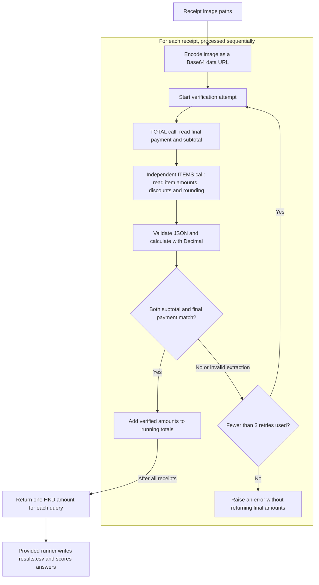

# FTEC5660 Homework 1: Receipt Chain

Build a LangChain pipeline that reads every supermarket receipt in a folder
with the vision-capable DeepSeek Flash model and answers these two questions:

1. How much money did I spend in total for these bills?
2. How much would I have had to pay without the discount?

For this homework, **amount spent** means the final payment after the receipt's
rounding line. **Without the discount** means the sum of the original positive
item prices: add back every promotion, coupon, member, app, packaging-damage,
and percentage discount, but do not add back rounding.

## Student task

Only edit the two functions in `hw1.py` that contain `### YOUR CODE HERE`:

- `build_chain()` creates your LangChain chain.
- `answer_queries()` runs the chain on the receipt images and returns one final
  response for each question.

You may use prompt chaining, routing, parallel calls, reflection, or a
combination. Your final responses should each contain one HKD amount. Do not
hard-code filenames or public answers; grading uses unseen receipt folders.

## Setup and public test

```bash
python3 -m venv .venv
source .venv/bin/activate
pip install -r requirements.txt
```

Put your DeepSeek key after `DEEPSEEK_API_KEY=` in `.env`, then run:

```bash
python3 hw1.py --image-folder public_test
```

The program creates `results.csv` in the current directory. Its columns are
`query`, `model_response`, and `correctness`. The public answers are in
`public_test/ground_truth.json`, which the provided runner uses for scoring
when the file is available.

The required model is `deepseek-v4-flash-vision-exp`, the vision-capable
DeepSeek Flash model. JPEG, PNG, GIF, and WebP inputs are accepted by the
homework runner.

## Homework 1 solution

### Chain design



### Solution description

I check each receipt using two separate model calls. `build_chain()` creates a
prompt, the required `deepseek-v4-flash-vision-exp` model, and a JSON output parser.
The TOTAL call reads the printed final payment and subtotal. The ITEMS call
independently reads the original item line amounts, discounts and signed rounding
adjustment; it does not receive the TOTAL response. Python uses `Decimal` to
calculate the subtotal as item amounts minus discounts, and the final payment as
that subtotal plus rounding. Both calculated values must exactly match the printed
values before the receipt is added to the running totals. An invalid extraction
or mismatch causes both methods to reread that receipt, with one initial attempt
and at most three retries. A persistent failure raises an error instead of returning
unverified totals. Once all receipts pass, the function returns the two exact query
strings with one HKD amount each, and the unchanged runner writes and scores the CSV.

### Extracted fields and calculation

| Method | Field | Meaning |
| --- | --- | --- |
| TOTAL | `amount_paid` | Printed final payment after rounding, not cash tendered or change |
| TOTAL | `subtotal` | Printed subtotal after discounts but before rounding |
| ITEMS | `item_amounts` | Original positive item line amounts, including bag charges |
| ITEMS | `discounts` | Individual discounts as positive amounts; empty only if none |
| ITEMS | `rounding` | Signed rounding adjustment; zero only if no rounding line exists |

For each receipt:

```text
before_discount = sum(item_amounts)
calculated_subtotal = before_discount - sum(discounts)
calculated_paid = calculated_subtotal + rounding

require subtotal == calculated_subtotal
require amount_paid == calculated_paid

query 1 += amount_paid
query 2 += before_discount
```

After validation, `before_discount` is equal to `subtotal + sum(discounts)`,
as required by the homework. Rounding is excluded from query 2. For the homework's
`receipt5.jpg` example, the independent calculation is
`10.00 + 36.90 + 60.80 - 5.39 - 0.01 = 102.30`; query 2 is HK$107.70.
Neither extraction nor aggregation reads the ground-truth answers. Agreement
detects inconsistent extractions, but cannot guarantee that both readings are correct.

`max_retries = 3` means at most four verification attempts per receipt, each
using up to two model calls. Model-client retries are disabled to avoid hidden
extra requests. API/connection errors propagate directly; the verification loop
retries invalid JSON, invalid amounts and arithmetic mismatches. Any exhausted
receipt stops the run without creating a new CSV. An existing CSV from an earlier
run is not refreshed, so it must not be mistaken for a successful current result.
The assignment requires a successful CSV-producing run for grading.

### Validation

Run the local checks with:

```bash
python -m unittest discover -s tests -v
```

The 13 local tests cover separate extraction calls, exact decimal
arithmetic, discounts, positive and negative rounding, multiple receipts, retry
recovery, the three-retry limit, invalid data and JSON, and suppression of CSV
output when a receipt fails. One integration test uses the real prompt, JSON
parser, runner and CSV writer with a simulated model. These checks validate control flow and arithmetic;
they do not establish real-model receipt-reading accuracy. Run the public test
command above to check actual image extraction.
